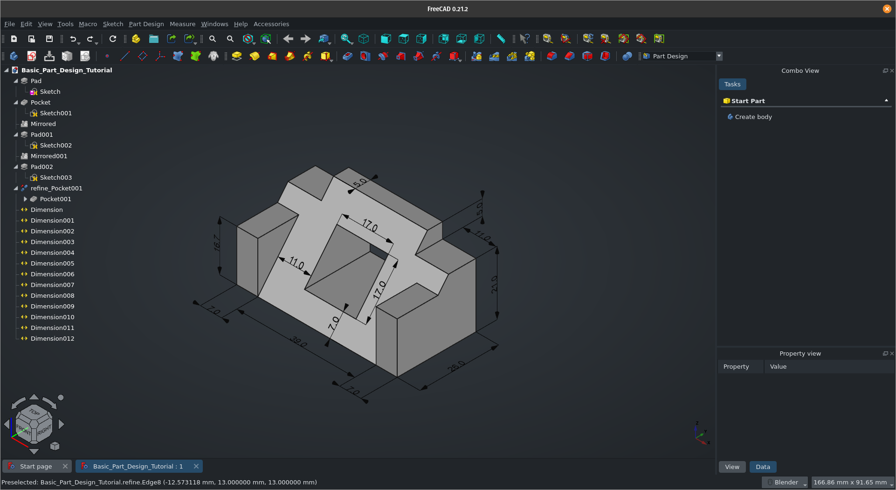
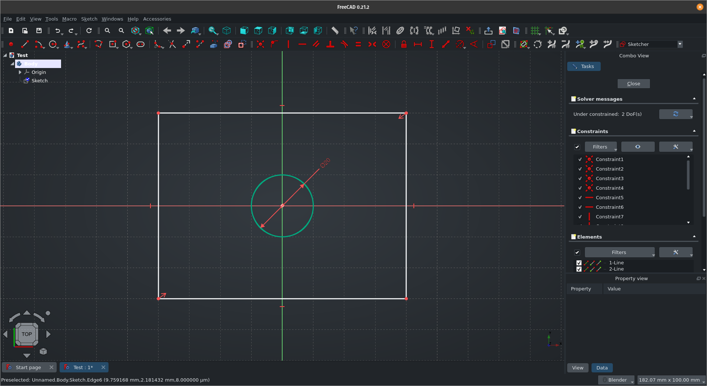

# Freecad Preferences

Custom preference for FreeCAD

## Dependencies

- Glass
- OpenDark
- PieMenu

## Tested

- [x] Linux
- [ ] Windows
- [ ] MacOSX

## Screenshots

Part Design

Sketcher


## Install

- Linux

```shell
chmod +x preferences.sh
./preferences.sh install
```

- Windows

  `To do`

- MacOSX

  `To do`

## Uninstall

- Linux

```shell
chmod +x preferences.sh
./preferences.sh uninstall
```

- Windows

  `To do`

- MacOSX

  `To do`
